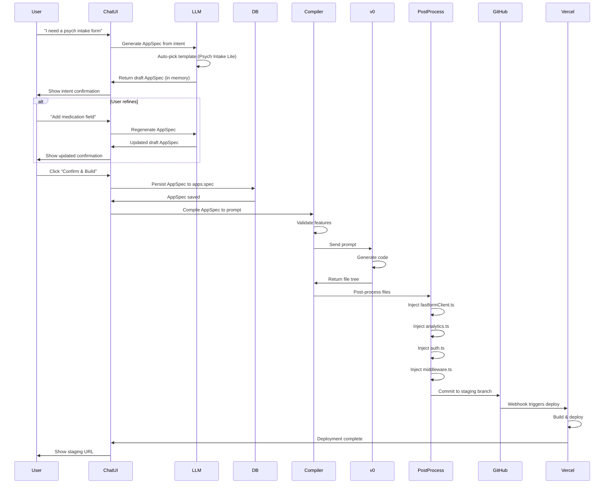
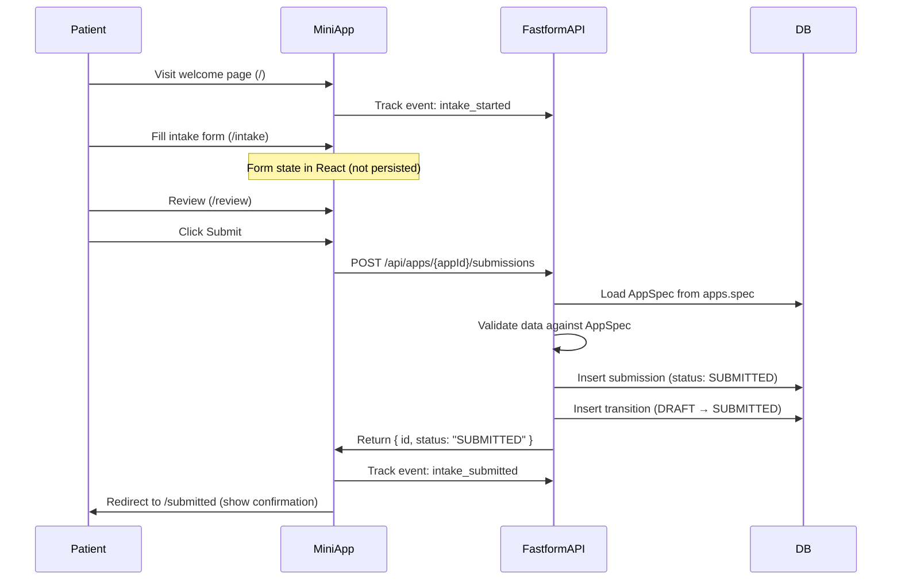
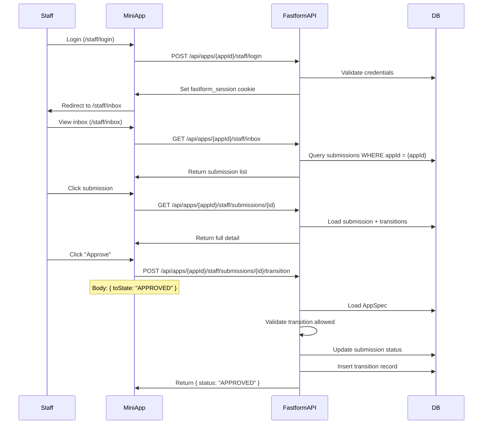
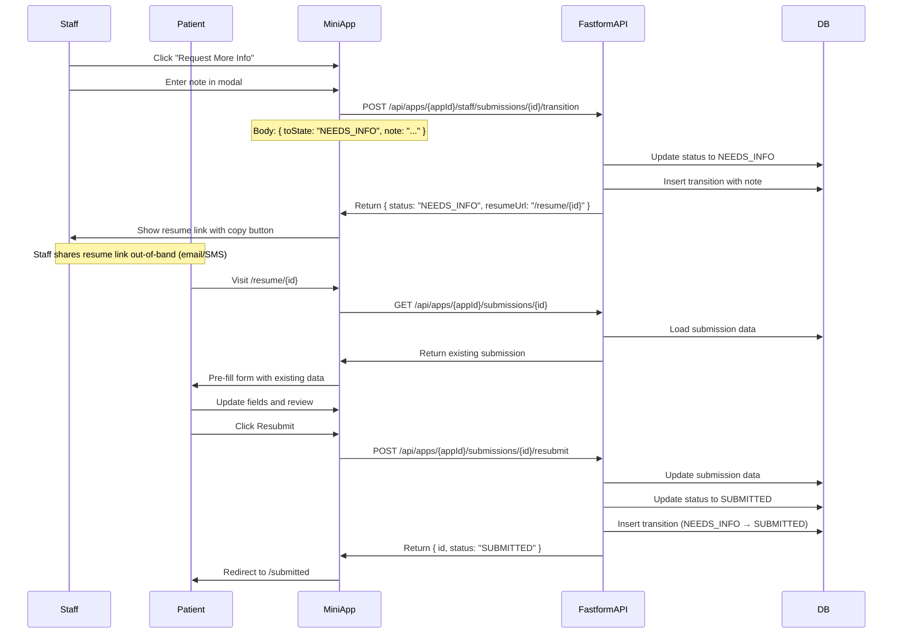

# Fastform Architecture Documentation

## Overview

Fastform is an AppSpec-driven platform for generating and deploying healthcare mini-apps. Users describe their needs in natural language, Fastform generates a structured AppSpec, compiles it to a prompt, uses v0 to generate code, and deploys the working application to Vercel.

This document describes the complete architecture of Fastform v1, including the AppSpec schema, the generation pipeline, the multi-tenant backend design, and the deployment strategy.

---

## Table of Contents

1. [Core Concepts](#core-concepts)
2. [AppSpec Schema](#appspec-schema)
3. [System Architecture](#system-architecture)
4. [Generation Pipeline](#generation-pipeline)
5. [Multi-Tenant Backend](#multi-tenant-backend)
6. [Deployment Strategy](#deployment-strategy)
7. [Auth & Security](#auth--security)
8. [Data Flow](#data-flow)

---

## Core Concepts

### AppSpec vs Generated App

**AppSpec** is the canonical, versioned configuration that *describes* an app. It serves as the single source of truth for everything about a mini-app: its pages, fields, workflow, theme, and API endpoints.

**Generated mini-app** is the deployable Next.js codebase produced by compiling the AppSpec into a prompt, passing it to v0, and post-processing the output.

Key relationship:
```
AppSpec (source) → Prompt Compiler → v0 → Post-processor → Deployable App (binary)
```

### Deterministic Generation

The prompt compilation is **deterministic**: the same AppSpec always produces the same prompt, which should produce consistent v0 output. No chat history is appended to the prompt - only the AppSpec matters.

This ensures:
- Reproducibility
- Auditability
- Version control
- Rollback capability

---

## AppSpec Schema

### Schema Version: v0.3

The AppSpec is a JSON document that describes a complete mini-app. It uses a structured schema with versioning support.

#### Top-Level Structure

```typescript
interface FastformAppSpec {
  id: string;                    // UUID - unique identifier
  version: "0.3";                // Schema version
  meta: AppMeta;                 // App metadata (name, slug, org)
  theme: ThemeConfig;            // Visual theme configuration
  roles: Role[];                 // User roles (PATIENT, STAFF)
  pages: Page[];                 // All pages in the app
  workflow: WorkflowConfig;      // State machine for submissions
  api: ApiConfig;                // API endpoints
  analytics: AnalyticsConfig;    // Event tracking
  environments: EnvironmentConfig; // Staging & production config
}
```

#### Key Components

**Meta**: Identifies the app and its organization
```typescript
interface AppMeta {
  name: string;        // Human-readable name
  slug: string;        // URL-safe identifier
  description: string; // Brief description
  orgId: string;       // Organization UUID
  orgSlug: string;     // Organization URL slug
}
```

**Roles**: Define access levels
```typescript
interface Role {
  id: "PATIENT" | "STAFF";
  authRequired: boolean;
  routePrefix?: string;  // e.g., "/staff"
}
```

**Pages**: Define the UI structure
```typescript
interface Page {
  id: string;
  route: string;
  role: "PATIENT" | "STAFF";
  type: PageType;        // welcome | form | review | success | login | list | detail
  title: string;
  description?: string;
  fields?: Field[];      // For form pages
  actions?: Action[];    // For detail pages (staff actions)
}
```

**Workflow**: State machine for submission lifecycle
```typescript
interface WorkflowConfig {
  states: WorkflowState[];
  initialState: WorkflowState;
  transitions: Transition[];
}

type WorkflowState = "DRAFT" | "SUBMITTED" | "NEEDS_INFO" | "APPROVED" | "REJECTED";
```

#### Field Types

Supported field types in v1:
- `text` - Single-line text input
- `email` - Email with validation
- `tel` - Phone number
- `date` - Date picker
- `textarea` - Multi-line text
- `select` - Dropdown
- `radio` - Radio buttons
- `checkbox` - Checkbox
- `number` - Numeric input

Each field supports:
- Labels and placeholders
- Required/optional validation
- Conditional visibility
- Custom validation rules

#### Environment Configuration

AppSpec includes environment-specific configuration:

```typescript
interface EnvironmentConfig {
  staging: {
    domain: string;    // e.g., "psych-intake-acme-staging.getfastform.com"
    apiUrl: string;    // Central backend URL for staging
  };
  production: {
    domain: string;    // e.g., "psych-intake-acme.getfastform.com"
    apiUrl: string;    // Central backend URL for production
  };
}
```

The `apiUrl` from the environment config is used to set `NEXT_PUBLIC_FASTFORM_API_URL` during deployment.

---

## System Architecture

### High-Level Architecture

```
┌─────────────────────────────────────────────────────────────────┐
│                         Fastform Platform                        │
│                                                                   │
│  ┌────────────────┐    ┌──────────────┐    ┌─────────────────┐ │
│  │  Chat UI       │───▶│  LLM Service │───▶│  AppSpec Store  │ │
│  │  (User Input)  │    │  (ChatGPT/   │    │  (PostgreSQL)   │ │
│  └────────────────┘    │   Claude)    │    └─────────────────┘ │
│                        └──────────────┘                          │
│                               │                                   │
│                               ▼                                   │
│                    ┌─────────────────────┐                       │
│                    │  Prompt Compiler    │                       │
│                    │  (AppSpec → Text)   │                       │
│                    └─────────────────────┘                       │
│                               │                                   │
│                               ▼                                   │
│                    ┌─────────────────────┐                       │
│                    │    v0 SDK           │                       │
│                    │  (Code Generation)  │                       │
│                    └─────────────────────┘                       │
│                               │                                   │
│                               ▼                                   │
│                    ┌─────────────────────┐                       │
│                    │  Post-Processor     │                       │
│                    │  (Inject Invariants)│                       │
│                    └─────────────────────┘                       │
│                               │                                   │
│                               ▼                                   │
│            ┌─────────────────────────────────────┐               │
│            │        GitHub Registry              │               │
│            │  (One repo per app: staging/main)   │               │
│            └─────────────────────────────────────┘               │
│                               │                                   │
│                               ▼                                   │
│            ┌─────────────────────────────────────┐               │
│            │         Vercel Platform             │               │
│            │  (Automatic deployment on push)     │               │
│            └─────────────────────────────────────┘               │
└───────────────────────────────────────────────────────────────────┘

                               │
                               ▼
              ┌────────────────────────────────┐
              │      Generated Mini-Apps       │
              │  (One deployment per app/env)  │
              └────────────────────────────────┘
                               │
                               ▼
              ┌────────────────────────────────┐
              │   Central Multi-Tenant Backend │
              │      (One backend for all)     │
              └────────────────────────────────┘
```

### Component Responsibilities

#### 1. Chat UI (User Interface)
- Collects user intent in natural language
- Displays intent confirmation with AppSpec preview
- Shows v0 preview during iteration
- Provides "Deploy to Staging" and "Promote to Production" buttons

#### 2. LLM Service (Intent → AppSpec)
- ChatGPT/Claude via Azure (preferred) or direct API
- Auto-picks closest template (Psych Intake Lite in v1)
- Generates draft AppSpec from user intent
- Iteratively refines AppSpec based on user feedback
- Uses structured output (JSON mode) for valid AppSpec

#### 3. AppSpec Store (Database)
- PostgreSQL with `apps` table
- `spec` column stores AppSpec as JSONB
- AppSpec persisted only after user confirms intent
- Version history tracked via deployments

#### 4. Prompt Compiler
- Transforms AppSpec JSON into natural language prompt
- Deterministic: same input → same output
- Includes hard constraints (no external libraries)
- Validates AppSpec against v1 supported features

#### 5. v0 SDK (Code Generation)
- Receives compiled prompt
- Generates complete Next.js codebase
- Returns file tree with all components
- No chat history - single-shot generation

#### 6. Post-Processor
- Injects invariant files (fastformClient, analytics, auth, middleware)
- Sets environment variables (API URL, app ID, org ID)
- Validates generated code structure
- Prepares for deployment

#### 7. GitHub Registry
- One repository per app: `{userId-prefix}-{appSlug}`
- Branch-based environments: `staging` and `main`
- Each deployment creates a new commit
- Version history for rollback

#### 8. Vercel Platform
- Automatic deployment via GitHub App integration
- Staging environment from `staging` branch
- Production environment from `main` branch
- Custom domains per app

---

## Generation Pipeline

### Chat → AppSpec → v0 → Deploy Flow



### Pipeline Stages

#### Stage 1: Intent Capture
1. User types natural language description
2. LLM generates heuristic name/slug (instant)
3. LLM creates draft AppSpec (in memory, not persisted)
4. System shows rich confirmation UI with:
   - Feature preview
   - Proposed name/slug (editable)
   - Action buttons (Confirm/Refine)

#### Stage 2: Iterative Refinement
1. User reviews draft AppSpec
2. If not satisfied, user continues chatting
3. LLM regenerates full AppSpec (not patched)
4. v0 preview updates after each iteration
5. Repeat until user confirms

#### Stage 3: AppSpec Persistence
1. User clicks "Confirm & Build"
2. Draft AppSpec persisted to `apps.spec` column
3. AppSpec becomes immutable source of truth

#### Stage 4: Prompt Compilation
1. AppSpec validated against v1 supported features
2. If unsupported feature detected, block and suggest alternatives
3. Compiler transforms AppSpec to natural language prompt
4. Prompt includes:
   - System context
   - Hard constraints (no external libraries)
   - Design requirements (theme, colors)
   - Page specifications
   - Workflow rules
   - API integration instructions
   - Analytics integration
   - File structure requirements

#### Stage 5: Code Generation
1. Prompt sent to v0 SDK
2. v0 generates complete Next.js codebase
3. All required files returned in file tree
4. No manual coding required

#### Stage 6: Post-Processing
1. Inject `lib/fastformClient.ts` (API client)
2. Inject `lib/analytics.ts` (event tracking)
3. Inject `lib/auth.ts` (staff authentication)
4. Inject `middleware.ts` (route protection)
5. Set environment variables:
   - `NEXT_PUBLIC_FASTFORM_API_URL`
   - `NEXT_PUBLIC_APP_ID`
   - `NEXT_PUBLIC_ORG_ID`

#### Stage 7: Deployment
1. Commit to GitHub `staging` branch
2. Vercel GitHub App webhook triggers
3. Vercel builds and deploys
4. Staging URL returned: `{slug}-{org}-staging.getfastform.com`

---

## Multi-Tenant Backend

### Central Backend Design

Fastform uses a **single multi-tenant backend** that serves all generated mini-apps. This is a standard SaaS pattern that's simpler and more maintainable than per-app backends.

#### Key Principles

1. **One Backend, Many Apps**: All mini-apps connect to the same central API
2. **AppSpec-Driven Behavior**: Backend behavior adapts based on the AppSpec
3. **Data Isolation**: All data is tenanted by `appId`
4. **Shared Infrastructure**: Auth, analytics, and workflow are centralized

#### Database Schema

```sql
-- Apps table (stores AppSpec)
CREATE TABLE apps (
  "id" UUID PRIMARY KEY,
  "orgId" UUID NOT NULL,
  "slug" TEXT NOT NULL,
  "name" TEXT NOT NULL,
  "spec" JSONB NOT NULL,           -- AppSpec is stored here
  "createdAt" TIMESTAMPTZ DEFAULT NOW()
);

-- Submissions (multi-tenant by appId)
CREATE TABLE submissions (
  "id" UUID PRIMARY KEY,
  "appId" UUID REFERENCES apps("id"),  -- Tenant key
  "data" JSONB NOT NULL,                -- Form data
  "status" TEXT NOT NULL DEFAULT 'SUBMITTED',
  "createdAt" TIMESTAMPTZ DEFAULT NOW(),
  "updatedAt" TIMESTAMPTZ DEFAULT NOW()
);

-- Workflow transitions (audit log)
CREATE TABLE submission_transitions (
  "id" UUID PRIMARY KEY,
  "submissionId" UUID REFERENCES submissions("id"),
  "fromState" TEXT NOT NULL,
  "toState" TEXT NOT NULL,
  "triggeredBy" UUID,                   -- staff user id, null for patient
  "note" TEXT,
  "createdAt" TIMESTAMPTZ DEFAULT NOW()
);

-- Analytics events
CREATE TABLE app_events (
  "id" UUID PRIMARY KEY,
  "appId" UUID REFERENCES apps("id"),   -- Tenant key
  "submissionId" UUID REFERENCES submissions("id"),
  "eventName" TEXT NOT NULL,
  "properties" JSONB,
  "timestamp" TIMESTAMPTZ NOT NULL,
  "createdAt" TIMESTAMPTZ DEFAULT NOW()
);

-- Staff users
CREATE TABLE staff_users (
  "id" UUID PRIMARY KEY,
  "orgId" UUID NOT NULL,
  "email" TEXT NOT NULL UNIQUE,
  "passwordHash" TEXT NOT NULL,
  "name" TEXT,
  "createdAt" TIMESTAMPTZ DEFAULT NOW()
);

-- Deployments tracking
CREATE TABLE app_deployments (
  "id" UUID PRIMARY KEY,
  "appId" UUID REFERENCES apps("id"),
  "environment" TEXT NOT NULL,          -- 'staging' | 'production'
  "vercelProjectId" TEXT,
  "vercelDeploymentId" TEXT,
  "url" TEXT,
  "deployedAt" TIMESTAMPTZ DEFAULT NOW()
);
```

**Note**: All column names use camelCase and are quoted for PostgreSQL compatibility.

#### API Endpoints

All mini-apps use the same API endpoints with `appId` in the URL:

**Patient Endpoints** (public):
- `POST /api/apps/:appId/submissions` - Create submission
- `GET /api/apps/:appId/submissions/:id` - Get submission
- `POST /api/apps/:appId/submissions/:id/resubmit` - Resubmit after NEEDS_INFO

**Staff Endpoints** (authenticated):
- `POST /api/apps/:appId/staff/login` - Staff login (sets session cookie)
- `POST /api/apps/:appId/staff/logout` - Staff logout
- `GET /api/apps/:appId/staff/session` - Check session
- `GET /api/apps/:appId/staff/inbox` - List submissions (filterable by status)
- `GET /api/apps/:appId/staff/submissions/:id` - Get submission detail
- `POST /api/apps/:appId/staff/submissions/:id/transition` - Change status

**Analytics Endpoint**:
- `POST /api/apps/:appId/events` - Track event

#### Validation Against AppSpec

The backend validates all submissions against the AppSpec:

1. Load AppSpec from `apps.spec` column
2. Extract required fields from pages where `type === 'form'`
3. Validate submission data:
   - All required fields present
   - Field types match (email regex, number type, etc.)
   - Select/radio options are valid choices
4. Return validation errors if any

#### Workflow State Machine

The backend enforces workflow transitions:

```typescript
// Example transitions for Psych Intake Lite
const transitions = [
  { from: "DRAFT", to: "SUBMITTED", allowedRoles: ["PATIENT"] },
  { from: "SUBMITTED", to: "APPROVED", allowedRoles: ["STAFF"] },
  { from: "SUBMITTED", to: "NEEDS_INFO", allowedRoles: ["STAFF"] },
  { from: "SUBMITTED", to: "REJECTED", allowedRoles: ["STAFF"] },
  { from: "NEEDS_INFO", to: "SUBMITTED", allowedRoles: ["PATIENT"] },
  { from: "NEEDS_INFO", to: "REJECTED", allowedRoles: ["STAFF"] }
];
```

Invalid transitions are rejected server-side.

---

## Deployment Strategy

### GitHub as Registry

Each app gets its own GitHub repository under the `getfastform` organization:

**Repo Naming**: `{userId-prefix}-{appSlug}`
- Example: `a1b2c3d4-psych-intake`

**Branch Strategy**:
- `staging` branch → Staging environment
- `main` branch → Production environment

**Benefits**:
- Version history for every deployment
- Rollback capability via git history
- Familiar CI/CD workflow
- Code review via pull requests (optional)

### GitHub + Vercel Integration

#### Setup
1. Install Vercel GitHub App on `getfastform` organization
2. Configure automatic deployments:
   - `staging` branch → Staging domain
   - `main` branch → Production domain

#### Deployment Flow

**Staging Deploy**:
```
1. User clicks "Deploy to Staging"
2. AppSpec compiled to prompt
3. v0 generates code
4. Post-processor injects invariants
5. Code committed to staging branch
6. Vercel GitHub webhook triggers
7. Vercel builds and deploys
8. Staging URL: {slug}-{org}-staging.getfastform.com
```

**Production Promotion**:
```
1. User clicks "Promote to Production"
2. System validates staging deploy succeeded
3. Create PR: staging → main (auto-merge)
4. Vercel GitHub webhook triggers on main
5. Vercel builds and deploys
6. Production URL: {slug}-{org}.getfastform.com
```

#### Environment Variables

Set per branch in Vercel:

**Staging**:
- `NEXT_PUBLIC_FASTFORM_API_URL=https://api-staging.getfastform.com`
- `NEXT_PUBLIC_APP_ID={appId}`
- `NEXT_PUBLIC_ORG_ID={orgId}`

**Production**:
- `NEXT_PUBLIC_FASTFORM_API_URL=https://api.getfastform.com`
- `NEXT_PUBLIC_APP_ID={appId}`
- `NEXT_PUBLIC_ORG_ID={orgId}`

### Domain Strategy

**Staging**: `{appSlug}-{orgSlug}-staging.getfastform.com`
**Production**: `{appSlug}-{orgSlug}.getfastform.com`

Custom domains per organization are deferred to v2.

---

## Auth & Security

### Staff Authentication

**Method**: Session-based auth with httpOnly cookies

**Flow**:
1. Staff user submits email + password to `/api/apps/:appId/staff/login`
2. Backend validates credentials against `staff_users` table
3. Backend creates session and sets `fastform_session` cookie:
   - httpOnly: true
   - secure: true
   - sameSite: 'Lax'
4. Frontend stores no tokens (cookie-only)

**Session Validation**:
- Middleware checks `fastform_session` cookie presence
- Backend validates session on all `/api/apps/:appId/staff/*` endpoints
- Invalid session → 401 response

### Patient Access

**Patient pages are public** (no authentication required for v1):
- Welcome page
- Intake form
- Review and submit
- Success page

**Resume Flow**:
- Resume link: `/resume/[submissionId]`
- In v1: simple ID-based URL (no token)
- v2: will add secure tokens for HIPAA compliance

### Injected Auth Module

All generated apps receive `lib/auth.ts`:

```typescript
export const auth = {
  login: async (email: string, password: string): Promise<{ success: boolean }>,
  logout: async (): Promise<void>,
  getSession: async (): Promise<{ user: { id: string; email: string } } | null>
};
```

And `middleware.ts`:

```typescript
export function middleware(request: NextRequest) {
  const { pathname } = request.nextUrl;

  // Protect /staff routes (except login)
  if (pathname.startsWith('/staff') && !pathname.startsWith('/staff/login')) {
    const sessionCookie = request.cookies.get('fastform_session');

    if (!sessionCookie) {
      const loginUrl = new URL('/staff/login', request.url);
      loginUrl.searchParams.set('redirect', pathname);
      return NextResponse.redirect(loginUrl);
    }
  }

  return NextResponse.next();
}
```

**Security Note**: Middleware only checks cookie presence for UX. Backend endpoints enforce full session validation.

---

## Data Flow

### Patient Submission Flow



### Staff Review Flow



### NEEDS_INFO Resume Flow



---

## Appendix: Example AppSpec

See `docs/1-slice-spec.md` for the complete Psych Intake Lite example AppSpec with all fields, pages, and workflow definitions.

---

## Appendix: Injected Files

### fastformClient.ts

API client injected into all generated apps. Handles all communication with central backend.

Key functions:
- `createSubmission(data)` - Patient submits form
- `getSubmission(id)` - Load existing submission (for resume)
- `resubmitSubmission(id, data)` - Patient resubmits after NEEDS_INFO
- `listSubmissions(filters)` - Staff inbox query
- `getSubmissionDetail(id)` - Staff view full submission
- `transitionSubmission(id, toState, note)` - Staff changes status

### analytics.ts

Event tracking module injected into all generated apps.

Functions:
- `track(eventName, properties)` - Track custom event
- `page(pageName)` - Track page view

All events sent to `POST /api/apps/{appId}/events`.

### auth.ts

Staff authentication module injected into all generated apps.

Functions:
- `login(email, password)` - Staff login
- `logout()` - Staff logout
- `getSession()` - Get current session

### middleware.ts

Route protection middleware injected into all generated apps. Protects `/staff/*` routes (except `/staff/login`) by checking for `fastform_session` cookie.

---

## Future Enhancements (v2+)

The following features are deferred to future iterations:

- **Multiple Templates**: Support templates beyond Psych Intake Lite
- **AppSpec Schema Evolution**: Versioning system for schema changes
- **Secure Resume Tokens**: HIPAA-compliant token-based resume links
- **Custom Domains**: Per-organization custom domains
- **SSO/SAML**: Enterprise authentication
- **EHR Integrations**: HL7/FHIR connectors
- **Advanced Field Types**: File upload, signature, rich text
- **Multi-language Support**: i18n for patient-facing pages
- **Scoped Regeneration**: Update specific pages without full rebuild
- **Drag-and-Drop Editor**: Visual AppSpec builder

---

## Conclusion

Fastform's architecture is built on the principle of **AppSpec as source of truth**. Every aspect of a generated app - from UI to workflow to API - is derived deterministically from the AppSpec. This enables:

- **Consistency**: Same AppSpec → same app
- **Maintainability**: One source to update, regenerate to apply changes
- **Auditability**: Full version history in git
- **Scalability**: Central multi-tenant backend serves all apps
- **Speed**: Pipeline from intent to deployed app in under 3 minutes

The architecture supports the core workflow: **Chat → AppSpec → v0 → Deploy**, with clear separation of concerns between components and strong data isolation in the multi-tenant backend.
